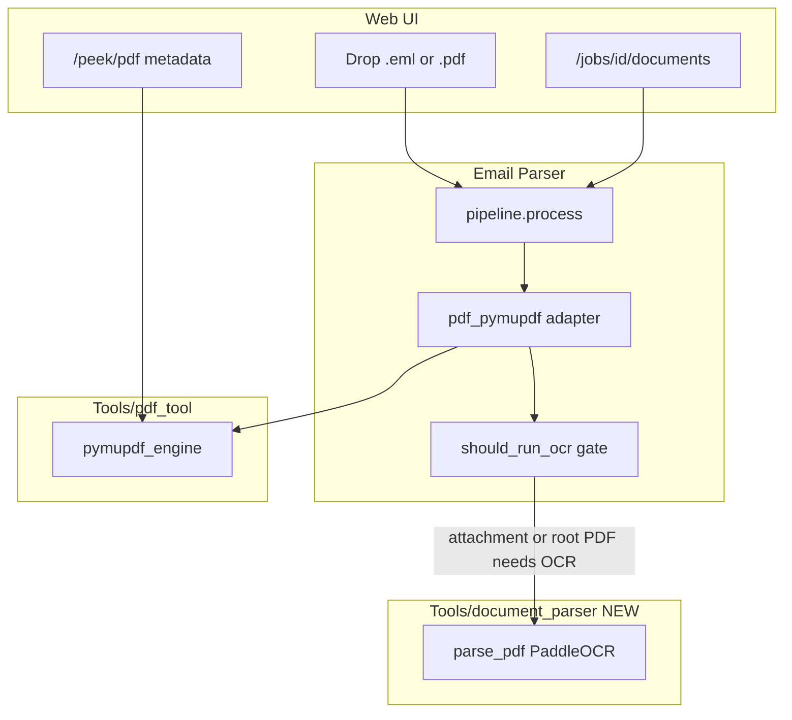

# Document Parser + OCR Integration Plan

## Architecture (mirror existing tools)

**Standalone tool in `Tools/`** + **thin email-parser adapter** + **optional path dependency** + **UI for direct PDF upload**.




| Layer             | Project                                                                         | Role                                                 |
| ----------------- | ------------------------------------------------------------------------------- | ---------------------------------------------------- |
| Born-digital PDF  | `[Tools/pdf_tool](../pdf_tool/)`                                                | Fast text-layer extraction (always runs first)       |
| Scanned PDF / OCR | `**Tools/document_parser**` (new)                                               | PaddleOCR when born-digital path is insufficient     |
| Email integration | `[pdf_pymupdf.py](Tools/Email Parser/email_parser/file_parsers/pdf_pymupdf.py)` | Compose tools; **gate OCR by context**               |
| Web UI            | `[web/](Tools/Email Parser/web/)`                                               | Accept PDFs, preview metadata, show document results |


---

## OCR trigger rules (attachment-scoped)

OCR runs **only** when **all** of the following are true:

1. `document_parser.is_available()` and `EMAILPARSE_OCR_ENABLED` (optional `--extra ocr` install)
2. Born-digital pass reports the PDF **requires OCR** (`needs_ocr=True`, or `ok` with zero/sparse blocks)
3. The blob is a **PDF attachment or a direct PDF upload** — not email body, not non-PDF types

```python
def should_run_ocr(blob: Blob, ctx: ParseContext, pdf_result: PdfParseResult, settings: Settings) -> bool:
    if not settings.ocr_enabled or not doc_parser_is_available():
        return False
    if not _pdf_needs_ocr(pdf_result):  # needs_ocr, empty blocks, or chars below threshold
        return False
    # Direct PDF upload (UI or CLI): root blob, no parent
    if blob.relation_to_parent is None and ctx.parent_id is None:
        return True
    # Email attachment / embedded / forwarded PDF child
    if blob.relation_to_parent is not None:
        return True
    return False
```


| Scenario                                                 | OCR?                                               |
| -------------------------------------------------------- | -------------------------------------------------- |
| `.eml` with born-digital PDF attachment (has text layer) | **No** — pdf_tool blocks are sufficient            |
| `.eml` with scanned PDF attachment (`needs_ocr`)         | **Yes** — if document_parser installed             |
| Direct `.pdf` upload (scanned)                           | **Yes** — if document_parser installed             |
| Direct `.pdf` upload (born-digital)                      | **No**                                             |
| OCR package not installed                                | **No** — keep pdf_tool result + provenance warning |


**Never OCR** born-digital PDFs that already extracted text. The born-digital pass always runs first; OCR is a **fallback**, not a default.

---

## Phase 1: Standalone `document_parser` tool

Create sibling project: `**Tools/document_parser/**` (same layout as before).

```
Tools/document_parser/
  pyproject.toml
  README.md
  document_parser/
    __init__.py       # parse_pdf, is_available, search_quote (optional v1)
    models.py         # DocBlock, DocParseResult — mirror pdf_tool field names
    raster.py         # ONLY pymupdf: PDF -> page images
    ocr/paddle_engine.py  # ONLY PaddleOCR imports
    pdf.py            # orchestration
    cli.py            # doc-parser parse file.pdf
  tests/
```

Public API:

```python
from document_parser import parse_pdf, is_available
result = parse_pdf(raw, filename="scan.pdf")
```

PaddleOCR backend (user choice): layout detection + bounding boxes, paragraph clustering by y-proximity.

---

## Phase 2: Email parser integration

### Optional dependency

`[Tools/Email Parser/pyproject.toml](Tools/Email Parser/pyproject.toml)`:

```toml
[project.optional-dependencies]
ocr = ["document-parser"]

[tool.uv.sources]
document-parser = { path = "../document_parser", editable = true }
```

Default: `uv sync` — no OCR. With OCR: `uv sync --extra web --extra dev --extra ocr`.

### Config (`[config.py](Tools/Email Parser/email_parser/config.py)`)


| Env var                    | Default | Meaning                                |
| -------------------------- | ------- | -------------------------------------- |
| `EMAILPARSE_OCR_ENABLED`   | `true`  | Master switch when package installed   |
| `EMAILPARSE_OCR_DPI`       | `200`   | Rasterization DPI                      |
| `EMAILPARSE_OCR_MIN_CHARS` | `20`    | Sparse-text threshold across all pages |


### Adapter (`[pdf_pymupdf.py](Tools/Email Parser/email_parser/file_parsers/pdf_pymupdf.py)`)

1. Always `parse_pdf` via pdf_tool
2. If `should_run_ocr(blob, ctx, result, settings)` → `document_parser.parse_pdf`
3. Merge: replace blocks from OCR; keep `embedded_files` from pdf_tool
4. Provenance: `parser="pdf_pymupdf+document_parser"`, `metadata.native.ocr_engine="paddle"`

Extract shared block mapping to `[_pdf_mapping.py](Tools/Email Parser/email_parser/file_parsers/_pdf_mapping.py)`.

### Root document listing (for UI)

Add to `[run.py](Tools/Email Parser/email_parser/run.py)`:

```python
def root_documents(documents: list[Document]) -> list[Document]:
    """Top-level items for UI: emails and direct-upload PDFs."""
    return [
        d for d in documents
        if d.parent_id is None and d.source_type in {SourceType.email, SourceType.pdf}
    ]
```

Keep `root_emails()` for metrics backward compatibility; UI uses `root_documents()`.

---

## Phase 3: Web UI — PDF upload and OCR-aware results

The UI already lists `.pdf` in `[index.html](Tools/Email Parser/web/templates/index.html)` accept attribute, but PDFs do not appear in results today because `/jobs/{id}/emails` calls `root_emails()` only.

### Backend API changes (`[web/routes.py](Tools/Email Parser/web/routes.py)`)


| Endpoint                   | Change                                                             |
| -------------------------- | ------------------------------------------------------------------ |
| `GET /health`              | Add `ocr_available: bool`, `ocr_enabled: bool`                     |
| `POST /peek/pdf`           | New — page count, `needs_ocr`, filename (uses pdf_tool quick scan) |
| `GET /jobs/{id}/documents` | New — root emails + root PDFs for sidebar                          |
| `GET /jobs/{id}/emails`    | Keep for backward compat; delegate to `root_documents` or alias    |


Document row shape:

```json
{
  "doc_id": "sha256:...",
  "kind": "email" | "pdf",
  "label": "subject or filename",
  "sender": "...",
  "date": "...",
  "status": "ok",
  "needs_ocr": false,
  "ocr_used": true,
  "attachment_count": 2
}
```

### Frontend changes (`[app.js](Tools/Email Parser/web/static/app.js)`, `[index.html](Tools/Email Parser/web/templates/index.html)`)

1. **Upload panel** — title: "Drop email or PDF files here"; hint mentions scanned PDFs need `--extra ocr`
2. `**addFile()**` — for `.pdf`, call `POST /peek/pdf` instead of `/peek`; show page count + "Scanned (OCR)" badge when `needs_ocr`
3. **Results sidebar** — rename "Processed emails" → **"Processed items"**; call `/jobs/{id}/documents`
4. **Row rendering** — PDF rows show filename + page count; email rows keep sender/subject
5. **OCR status** — if `ocr_used`, show badge; if `needs_ocr && !ocr_available`, show warning toast after job completes
6. **Health on load** — `loadHealth()` reads `ocr_available`; disable OCR hint or show install message when false

### CSS (`[app.css](Tools/Email Parser/web/static/app.css)`)

- Badge styles for `pdf`, `ocr`, `scanned` item types

---

## Phase 4: Tests and docs

### document_parser

- `test_is_available`, `test_parse_scanned_pdf`
- `@pytest.mark.ocr` for Paddle-dependent tests

### Email parser

- `test_ocr_skipped_for_born_digital_attachment` — attachment PDF with text → no OCR call (mock document_parser)
- `test_ocr_runs_for_scanned_attachment` — `@pytest.mark.ocr`
- `test_direct_pdf_upload_lists_in_root_documents` — API test: upload scanned PDF → `/documents` returns 1 row
- `test_peek_pdf_endpoint` — returns page_count and needs_ocr
- Import isolation: Paddle only in `document_parser/ocr/paddle_engine.py`

### Docs

- `Tools/document_parser/README.md`
- Update `[USER_MANUAL.md](Tools/Email Parser/docs/USER_MANUAL.md)`, `[CODEBASE_OVERVIEW.md](Tools/Email Parser/docs/CODEBASE_OVERVIEW.md)`

---

## Agent execution strategy


| Task                                                                 | Agent                          | Rationale                            |
| -------------------------------------------------------------------- | ------------------------------ | ------------------------------------ |
| Scaffold document_parser, paddle engine, tests                       | **Composer 2.5** subagent      | Mechanical, follows pdf_tool pattern |
| OCR gate + pdf_pymupdf adapter                                       | **Composer 2.5** subagent      | Small, well-specified diff           |
| API endpoints (peek/pdf, documents, health)                          | **Composer 2.5** subagent      | CRUD-style routes                    |
| UI (app.js, index.html, css)                                         | **Composer 2.5** subagent      | Frontend wiring from spec            |
| **Validate OCR trigger matrix, review integration, run full pytest** | **Coordinator / larger model** | Design correctness, edge cases       |
| Docs pass                                                            | **Composer 2.5** subagent      | After validation sign-off            |


Coordinator runs tests after each phase; only escalates to larger model for architecture review and final validation.

---

## What NOT to do in v1

- Do not OCR every PDF — only `needs_ocr` / sparse attachments and direct scanned uploads
- Do not OCR email bodies or non-PDF MIME parts
- Do not bundle PaddleOCR in default email-parser install
- Do not add a competing `resolve_parser` plugin — keep composition in `pdf_pymupdf.py`
- Do not merge document_parser into pdf_tool

---

## Build order

1. Scaffold `Tools/document_parser` (fast subagent)
2. Implement Paddle engine + `parse_pdf` + tests (fast subagent)
3. Email-parser optional dep + `should_run_ocr` gate in adapter (fast subagent)
4. API: `root_documents`, `/peek/pdf`, `/documents`, health flags (fast subagent)
5. UI: PDF preview, document sidebar, OCR badges (fast subagent)
6. **Validation pass** — full test matrix, trigger logic review (larger model)
7. Docs (fast subagent)

