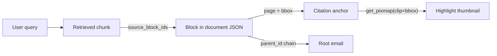

# Email Parser Build Loop

## Confirmed decisions

- Scope: parser core + test/metrics harness + FastAPI + two-pane UI. No embeddings this iteration; output is RAG-ready.
- Output destination: `./output/` (configurable via `EMAILPARSE_OUTPUT_DIR`, gitignored).
- PDF engine: **PyMuPDF 1.28.2**, imported as `import pymupdf` (not `fitz`). AGPL-3.0 / commercial dual license, fine for local use; revisit only if this ships in a closed product.
- Security hardening explicitly out of scope. Bind to `127.0.0.1` locally (`0.0.0.0` inside Docker, or port mapping will not reach the app).
- Packaged with Docker; `./output/` is a mounted volume so results stay inspectable from the host.
- Build process: parent model coordinates, reviews, and talks to the user; cheaper subagents (`composer-2.5-fast` by default) write isolated files, tests, Docker, and docs in parallel. Escalate only after a small subagent fails twice or the work is contract-sensitive.

## Why citations drive the whole data model

The load-bearing requirement is that a model answer must resolve back to a page and bounding box. That forces one chain to be intact end to end:



Every block carries `doc_id`, `block_id`, `page`, `bbox`. Every chunk carries `source_block_ids`. Every document carries `parent_id` / `root_id`. Nothing may be emitted without these, which is what Phase 6 enforces as a hard invariant.

## Output file structure (`./output/`)

```
output/
├── manifest.json                        # store index: runs, parser versions, doc counts
├── blobs/<hh>/<sha256>.<ext>            # raw bytes, content-addressed -> free dedupe
├── documents/<hh>/<doc_id>.json         # canonical document JSON (sharded by hash prefix)
├── threads/<thread_id>.json             # ordered root doc_ids from Message-ID/References
├── context/<root_id>.md                 # compact derived view (exactly what the model sees)
├── chunks/<root_id>.jsonl               # retrieval chunks + denormalized provenance
├── citations/<doc_id>/anchors.json      # block_id -> {page, bbox, quads}
├── citations/<doc_id>/p<page>_<blk>.png # optional highlight thumbnails
├── runs/<run_id>/{run.json,metrics.json,log.jsonl}
└── index.sqlite                         # structured columns + FTS5 over chunk text
```

Hash-prefix sharding keeps directories small. `blobs/` is content-addressed so the same attachment across many emails is stored and parsed once.

## Project structure

Folder names say what lives in them. The library never imports the web layer.

```
email-parser/
├── email_parser/                  # CORE LIBRARY - no web dependencies, reusable
│   ├── models.py                  # Pydantic Document, Block, Anchor, enums
│   ├── ids.py                     # content-addressed doc_id, stable block_id
│   ├── config.py                  # output dir, limits, PDF engine selection
│   ├── file_parsers/              # PLUGGABLE per-file-type parsers
│   │   ├── base.py                # Parser protocol, Blob, ParseResult
│   │   ├── registry.py            # entry-point discovery and dispatch
│   │   ├── email_mime.py          # .eml via stdlib email
│   │   ├── pdf_pymupdf.py         # PDF via PyMuPDF (engine is IN the filename)
│   │   └── text_plain.py          # trivial 3rd parser, proves the plug-in path
│   ├── pipeline.py                # iterative worklist orchestrator
│   ├── storage/
│   │   ├── writer.py              # materializes output/, exposes paths()
│   │   └── sqlite_index.py        # index.sqlite + FTS5
│   ├── ai_context/                # everything an AI model consumes
│   │   ├── context_view.py        # compact derived view
│   │   ├── chunker.py             # RAG chunks with provenance
│   │   └── citations.py           # block -> page/bbox, quote back-mapping
│   ├── metrics/
│   │   ├── run_metrics.py         # Tier A
│   │   ├── health_metrics.py      # Tier B
│   │   └── accuracy_metrics.py    # Tier C
│   └── cli.py
├── web/                           # FastAPI + UI, imports email_parser
│   ├── app.py, routes.py, jobs.py
│   ├── templates/index.html
│   └── static/app.js, app.css
├── tests/
│   ├── fixtures/{generate.py, synthetic/, public/}
│   └── test_*.py
├── docs/{USER_MANUAL.md, MANUAL_STEPS.md, ADDING_A_PARSER.md, METRICS.md}
├── output/                        # generated, gitignored
├── Dockerfile, docker-compose.yml, .dockerignore
└── pyproject.toml, README.md
```

Naming the PDF module `pdf_pymupdf.py` rather than `pdf_parser.py` is deliberate: swapping engines means adding `pdf_pdfplumber.py` next to it and flipping one config value, and the filenames make that obvious to the next reader.

## Parser plug-and-play contract

This is the extension point, so it is fixed in Phase 0 and never changed afterwards. Every parser, built-in or third-party, implements exactly this and nothing more:

```python
class Parser(Protocol):
    name: str            # "pdf_pymupdf"
    version: str         # bumped when output changes -> drives reprocessing
    priority: int        # highest claim wins when several parsers match

    def can_handle(self, mime_type: str, sniffed: bytes) -> bool:
        """Claim a blob by sniffed magic bytes, never by file extension."""

    def parse(self, blob: Blob, ctx: ParseContext) -> ParseResult:
        """Return (document, child_blobs). NEVER recurse - hand children back."""
```

Two rules make it genuinely plug-and-play rather than nominally so. Parsers are discovered through `importlib.metadata.entry_points(group="email_parser.parsers")`, so a new file type ships as a separate package with zero edits to core. And because `parse()` returns child blobs instead of recursing, a new parser automatically inherits depth limits, cycle detection, dedupe, failure isolation, and progress reporting from `pipeline.py`.

Phase 4 proves this rather than asserting it: a third parser (`text_plain.py`) and a test that registers a dummy parser from a fixture package and swaps the PDF engine via config.

## Standing rules for every phase

1. **Validation gate.** Every phase ends by running `pytest` plus the phase's acceptance checks. Do not advance on red.
2. **Self-correction protocol.** When validation fails or a design flaw surfaces: stop, report a numbered list of issues with a proposed fix and its blast radius, ask for approval via the question tool, then implement only what was approved.
3. **No invented APIs.** Verify library calls against the LangChain / OpenAI docs MCP servers or official docs before writing them. Say "not found in docs" rather than guessing.
4. **Comments.** A docstring on every function; inline comments only where intent is non-obvious.
5. **Determinism.** Sorted keys, content-addressed IDs, no wall-clock values inside compared payloads.
6. **Delegate mechanical work.** The parent (this conversation) is the coordinator. Default to launching cheaper subagents for bounded, well-specified tasks. Keep design, protocol changes, and review in the parent. See the coordinator protocol below.

---

## Coordinator delegation protocol

The parent model plans, specifies, reviews, and talks to the user. Smaller/faster subagents write files, run commands, and do isolated research. This is a standing rule for the entire build, not just Phase 0.

### Who does what

**Parent keeps (do not delegate):**
- Phase kickoff: decide what to build, the file list, and the acceptance checks
- Frozen contracts: `Parser` protocol, Pydantic models, relation vocabulary, output layout
- Self-correction proposals and user-approval questions
- Synthesis after subagents return: merge, reject, or request a rewrite
- Final validation judgment for a phase (green/red, whether to advance)

**Delegate to a small/fast subagent** (`composer-2.5-fast` unless the user asked for another listed model):
- Single-file or few-file implementations against a written spec (ids, config, CLI stubs, `text_plain.py`, metric helpers, Dockerfile, compose, `.dockerignore`, static CSS/JS, Jinja templates)
- Boilerplate tests that follow an existing pattern (`test_determinism.py`, metric unit tests, API TestClient cases)
- Mechanical docs once the design section is outlined (`ADDING_A_PARSER.md` worked example, `METRICS.md` tables, `MANUAL_STEPS.md` checklists)
- Isolated research (confirm one API, one package version, one doc page)
- Running a bounded command (`uv sync`, `pytest` for one file, `ruff check`)

**Escalate to a larger subagent only if a small one fails twice** on the same task, or the work is multi-file and contract-sensitive (MIME walk, PDF citation extraction, pipeline guards, SSE job runner). Prefer `composer-2.5-fast` first; escalate only when stuck.

### How to brief a subagent

Every Task prompt must be self-contained. The subagent cannot see this chat. Include all of:

1. Goal in one sentence
2. Exact file paths to create or edit
3. The contract it must obey (paste the `Parser` protocol, model fields, or API names — do not say "as designed")
4. Verified library calls (import path, function name, key kwargs) — parent looks these up first
5. What it must NOT do (no recursion, no `import fitz`, no fastapi import in `email_parser/`, no invented fields)
6. Acceptance checks it should run before returning
7. Return format: files written, commands run, leftover failures — no raw tool dumps

Launch independent subagents in **one parent turn** when their files do not overlap. Example Phase 0 parallel set: models+ids, package `__init__` stubs, `pyproject.toml`+gitignore, first model-roundtrip test.

### Review gate (parent, after every subagent)

Do not accept a subagent's work unread. Check:

- Files landed where the spec said
- No contract drift (new fields, leaked pymupdf types, recursion inside a parser)
- Acceptance command actually ran and passed
- If it failed: parent writes a numbered issue list, asks the user for approval, then either re-briefs a small subagent with the approved fix or patches it in the parent if the change is one file and under ~30 lines

### Per-phase delegation map

| Phase | Parent | Parallel small subagents |
|---|---|---|
| 0 | models.py, Parser protocol, config | `__init__` stubs, ids.py, pyproject.toml, gitignore, model-roundtrip test |
| 1 | fixture case list and truth schema | generate.py, public-fixture fetch script, README licenses |
| 2 | MIME walk and body-split design | header helpers, HTML-to-blocks, quotequail wrapper, per-file tests |
| 3 | citation/table extraction design | pdf_pymupdf.py against pasted APIs, header/footer helper, test_pdf_pymupdf.py |
| 4 | pipeline guards | registry.py, text_plain.py, test_plugin_swap.py, hypothesis guard tests |
| 5 | schema of index.sqlite | writer.py, sqlite_index.py, paths() helper, test_storage.py |
| 6 | context-view budget rules | context_view.py, chunker.py, citations.py, their tests |
| 7 | which metrics ship | run/health/accuracy modules, test_metrics.py, test_invariants.py, test_snapshots.py |
| 8 | job/SSE design | routes.py, jobs.py, TestClient tests |
| 9 | results-view information architecture | index.html, app.css, app.js, postal-mime wiring |
| 10 | compose env and path-prefix policy | Dockerfile, docker-compose.yml, .dockerignore |
| 11 | USER_MANUAL design-choice sections | MANUAL_STEPS.md, ADDING_A_PARSER.md, METRICS.md, README.md |
| 12 | judgment on checklist and baseline | compare CLI, running pytest/docker test profile |

If a phase has only one hard file, the parent may write that file and still delegate its tests.

---

## Phase 0 - Scaffold and canonical model

```
Create a Python 3.12+ project at the repo root using uv, with EXACTLY the
folder layout in the "Project structure" section of this plan. Create every
package directory with an __init__.py, even where the module is a stub, so
the shape of the project is visible from the first commit.

Core deps: pydantic>=2, pymupdf==1.28.2, puremagic, selectolax,
charset-normalizer, quotequail, typer, tiktoken.
Web deps (separate optional group): fastapi, uvicorn, python-multipart, jinja2.
Dev deps: pytest, syrupy, ruff, mypy, hypothesis, rapidfuzz, apted.

HARD RULE: email_parser/ must never import fastapi or anything from web/.
Add a test that asserts this by importing email_parser with fastapi absent
from sys.modules.

In file_parsers/base.py define the Parser protocol, Blob and ParseResult
EXACTLY as written in the "Parser plug-and-play contract" section. This is
the frozen extension point.

In config.py expose settings with env overrides:
  EMAILPARSE_OUTPUT_DIR   (default ./output)
  EMAILPARSE_PDF_ENGINE   (default "pdf_pymupdf")
  EMAILPARSE_MAX_DEPTH    (default 10)
  EMAILPARSE_MAX_FANOUT   (default 200)
  EMAILPARSE_DISPLAY_PATH_PREFIX (default "" - used to show HOST paths in the
    UI when running under Docker)

In models.py define Pydantic v2 models exactly as designed:
  Document: doc_id, source_type, mime_type, root_id, parent_id,
    relation_to_parent, depth, ordinal, path, metadata{common,native},
    blocks[], extractions[], provenance{parser,parser_version,parsed_at,status,warnings}
  Block: block_id, type (heading|paragraph|list|table|image_ref|quoted_history|
    signature|form_field), text|rows|child_doc_id, anchor{page,bbox,quads}
  RelationType enum: attachment, inline_image, embedded_file,
    forwarded_message, link_reference, derived

ids.py: doc_id = "sha256:" + sha256(raw_bytes).hexdigest(); block_id stable
and derived from position, never random.

Acceptance: `ruff check`, `mypy email_parser`, a test asserting
model_dump_json() round-trips and doc_id is stable across two runs, and the
no-fastapi-import test passes.
```

## Phase 1 - Fixture generator and golden corpus

```
Build tests/fixtures/generate.py that synthesizes .eml files with ground
truth known by construction, writing sidecar <name>.truth.json holding
expected attachment count, tree shape, decoded subject, quoted/new body
split, and per-attachment page counts.

Generate at least these cases:
  plain no-attachment; single PDF; five PDFs; PDF embedded inside a PDF;
  forwarded email (message/rfc822) carrying its own PDF; HTML body with a
  cid: inline image; RFC 2047 encoded subject and non-ASCII sender;
  duplicate attachment filenames; zero-byte attachment; corrupt PDF;
  ten-deep reply thread; multipart/alternative with divergent text vs HTML;
  missing Date header; empty Subject.

Generate the PDFs with PyMuPDF so page count, text and table content are
known exactly. Use stdlib email.message.EmailMessage with policy=default
to build the messages.

Also vendor permissively licensed real samples into tests/fixtures/public/:
SpamScope mail-parser tests/mails (Apache-2.0), CPython
Lib/test/test_email/data (PSF), pdfplumber tests/pdfs (MIT). Record
provenance and license per file in a README. Do not vendor GPL fixtures.

Acceptance: generator is deterministic (same bytes on re-run) and produces
>=15 synthetic emails each with a .truth.json.
```

## Phase 2 - Email parser

```
Implement email_parser/file_parsers/email_mime.py against the frozen Parser
protocol, using ONLY the stdlib email package:
email.parser.BytesParser(policy=email.policy.default).

Requirements:
  - Walk the MIME tree; for multipart/alternative CHOOSE one part (prefer
    HTML), never concatenate.
  - HTML -> blocks via selectolax, preserving headings, lists, tables and
    link targets. Resolve cid: refs to the matching inline part and emit an
    image_ref block whose child_doc_id points at it.
  - Split body into new content vs quoted_history vs signature using
    quotequail. Keep quoted history as blocks, never delete it.
  - Headers: decoded subject, addresses split into display name / local /
    domain, Date normalized to UTC while retaining original offset,
    Message-ID / In-Reply-To / References captured for threading.
  - message/rfc822 parts yield a CHILD BLOB with
    relation_to_parent=forwarded_message, to be recursed by the orchestrator.
  - Attachments yield child blobs with relation attachment or inline_image
    and a preserved ordinal.
  - Sniff child types with puremagic; never trust the filename extension.
  - Use charset-normalizer when the declared charset fails to decode.

Return ParseResult(document, child_blobs). Do not recurse inside the parser.

Acceptance: tests/test_headers.py, test_mime_structure.py,
test_body_selection.py, test_quoting.py, test_cid_linkage.py all pass
against every fixture .truth.json.
```

## Phase 3 - Pluggable PDF parser with citation anchors

```
Implement email_parser/file_parsers/pdf_pymupdf.py against the frozen Parser
protocol, with `import pymupdf` (v1.28.2), NOT `import fitz`.

MODULARITY REQUIREMENTS - these matter more than the extraction code:
  - All PyMuPDF calls live in this ONE file. No pymupdf import anywhere else
    in the codebase, so a future pdf_pdfplumber.py is a drop-in sibling.
  - name = "pdf_pymupdf", claimed via can_handle() on sniffed %PDF- magic
    bytes, selected by config EMAILPARSE_PDF_ENGINE.
  - Emit only the generic Block/Anchor models from models.py. Never leak a
    pymupdf Rect, Quad, Page or Document object past this module's boundary -
    convert to plain tuples/floats at the edge.
  - Put the citation back-mapping behind an engine method too, so a swapped
    engine supplies its own implementation.

Verified APIs to use, do not substitute:

  page.get_text("dict", sort=True) -> {"blocks":[{bbox, lines:[{bbox,
    spans:[{bbox, font, size, flags, text}]}]}]}. bbox exists at block,
    line AND span level. sort=True gives reading order.
  page.find_tables() -> TableFinder; iterate .tables; per table use
    .extract() for rows, .bbox, .cells, .header.names, .row_count, .col_count.
  doc.metadata, doc.page_count, doc.needs_pass, doc.get_toc()
  page.widgets() -> w.field_name / w.field_value for AcroForm data
  doc.embfile_count() / embfile_names() / embfile_info() / embfile_get()
  page.annots(): if annot.type[0] == pymupdf.PDF_ANNOT_FILE_ATTACHMENT (17)
    then annot.get_file() -> bytes, annot.file_info -> dict

Emit one block per text block with anchor={page, bbox}; one table block per
detected table with rows plus its bbox; drop repeating headers/footers by
detecting identical text at the same y-range across pages.

Emit child blobs for every embedded file and FileAttachment annotation so
PDF-in-PDF recursion works.

Set metadata.native.has_text_layer per page using a chars-per-page
heuristic (len(page.get_text("text").strip())); flag needs_ocr=True and
skip rather than failing when a page has no text layer.

Do NOT use pymupdf4llm: its page_boxes are coarse layout boxes with
character offsets into a markdown string, which cannot support pinpoint
citations.

Acceptance: tests/test_pdf_pymupdf.py asserts every block has a non-null
page and bbox, table rows match fixture ground truth, PDF-in-PDF yields a
child blob, chars-per-page is non-zero for all born-digital fixtures, and a
grep confirms `pymupdf` is imported in exactly one module.
```

## Phase 4 - Registry, pipeline, and proof of plug-and-play

```
file_parsers/registry.py: discover parsers via
importlib.metadata.entry_points(group="email_parser.parsers"). Built-ins
register through the SAME mechanism as third parties - no special-casing, or
the plug-in path will silently rot. Dispatch by sniffing magic bytes with
puremagic, resolving ties by parser priority, and falling back to a stub
document with status="unsupported" carrying the sniffed type.

Add file_parsers/text_plain.py - a deliberately trivial parser for
text/plain. Its job is to prove the extension path works with a real third
module, and to serve as the worked example in docs/ADDING_A_PARSER.md.

pipeline.py: iterative worklist, never Python recursion.
  queue = [(root_blob, parent_id=None, depth=0)]
  guards: max_depth, max_fanout, and a seen-set of content hashes for cycle
    and duplicate detection
  a failed child MUST still emit a Document with status="failed" and the
    exception recorded in provenance.warnings - never silently vanish
  assign root_id, ordinal and the human-readable path ("email/attachment[2]")
  emit a progress callback per item so the API can stream it unchanged

Acceptance:
  tests/test_registry.py - dispatch by magic bytes; a mislabeled .txt that is
    really a PDF routes to the PDF parser; unknown type yields the stub.
  tests/test_plugin_swap.py - THE key modularity test. Register a dummy
    parser defined in tests/fixtures/plugin_pkg/ via entry points and assert
    the pipeline picks it up with no change to core; then set
    EMAILPARSE_PDF_ENGINE to a stub engine and assert PDFs route to it.
  tests/test_recursion_guards.py - hypothesis-generated pathological nesting;
    depth cap, cycle, and fanout cap all hold without OOM or stack overflow.
```

## Phase 5 - Store writer and SQLite index

```
Implement storage/writer.py to materialize exactly the output/ layout in this
plan. Content-addressed blobs, hash-prefix sharded documents, per-run
directory with run.json / metrics.json / log.jsonl (append-only JSONL).

ALSO expose a paths(doc_id) -> StoragePaths helper returning ABSOLUTE local
paths for: blob, document_json, context_md, chunks_jsonl, citations_dir.
The UI uses this for its verification links, so it belongs in the library
rather than being reconstructed by string-joining in the web layer. Apply
config.EMAILPARSE_DISPLAY_PATH_PREFIX when set, so a Docker run can display
the equivalent HOST path instead of the useless in-container path.

storage/sqlite_index.py: single output/index.sqlite via stdlib sqlite3.
  documents table with REAL columns: doc_id, root_id, parent_id,
    relation_to_parent, depth, source_type, mime_type, sent_at, from_addr,
    from_domain, subject, byte_size, page_count, status, parser_version
  blocks table: block_id, doc_id, type, page, bbox_json, text
  chunks table: chunk_id, root_id, doc_id, source_block_ids_json, text
  FTS5 virtual table over chunks.text (and blocks.text), contentless-linked
  JSON columns for metadata/native and extractions, queried via json_extract

Writes must be idempotent: re-running the same input produces byte-identical
files and no duplicate rows.

Acceptance: tests/test_storage.py parses the corpus twice and asserts
byte-identical output plus stable row counts; a FTS5 MATCH query returns the
expected chunk; paths() returns paths that all exist on disk.
```

## Phase 6 - Derived views: context, chunks, citations

```
ai_context/context_view.py -> output/context/<root_id>.md. Explicit ontology
preamble then budgeted content:

  EMAIL E1 - <date>, <sender> -> <recipients>
  Subject: <subject>
  Thread: <n> of <m>. Attachments: <k>
    A1 = <name> (<type>, <pages>pp) - referenced in body <block>
    A2 = <name> - FAILED: <reason>
  [E1 body, new content only]

Exclude quoted history by default. Enforce a token budget with tiktoken.
Fence all email-derived text as untrusted data.

ai_context/chunker.py -> output/chunks/<root_id>.jsonl. Every chunk carries
source_block_ids, doc_id, root_id, relation_to_parent, page range, and a
one-line provenance header prepended to the embedded text.

ai_context/citations.py:
  build output/citations/<doc_id>/anchors.json mapping block_id ->
    {page, bbox, quads}
  resolve_quote(doc_id, quote) using page.search_for(needle, quads=True,
    clip=block_bbox) -> list[Quad]. Note: no regex support, multi-line
    needles return one quad per line fragment, and dehyphenation is on by
    default. For long passages, split into phrases and search each, then
    confirm with page.get_textbox(rect).
  render_thumbnail(doc_id, page, rect) using
    page.get_pixmap(dpi=150, clip=rect).tobytes("png")

Acceptance: tests/test_citations.py takes a known sentence from a fixture
PDF, resolves it to a page and quad, and asserts the quad falls inside the
originating block's bbox. tests/test_context_view.py asserts the compact
view stays under budget and contains no quoted history.
```

## Phase 7 - Metrics and full test harness

```
Implement email_parser/metrics/ with three tiers and unit-test the metric
functions themselves (a wrong metric makes every number meaningless).

  run_metrics.py (Tier A, always computable): counts accepted/rejected/
    deduped, emails parsed, attachments by type, docs produced, max depth,
    wall clock and p50/p95 per email and per attachment, failures by stage
    and exception type, partial successes.
  health_metrics.py (Tier B, no ground truth): chars per PDF page, anchor
    coverage percent, quoted-text ratio, cid resolution rate, invariant
    violation count, determinism check.
  accuracy_metrics.py (Tier C, labeled corpus only):
    field-level precision/recall/F1, micro and macro
    ANLS: 1-NED if NED < tau else 0, tau = 0.5 (from ST-VQA, Biten et al.
      ICCV 2019, later adopted by DocVQA) - use rapidfuzz
    NED for body text and for reading order over ordered block-ID sequences
      (NED is the OmniDocBench standard for reading order, not Kendall tau)
    TEDS for tables via apted (PubTabNet, arXiv:1911.10683)
    line-level precision/recall/F1 for quote and signature stripping

tests/test_invariants.py parametrizes over the ENTIRE corpus and asserts:
no orphan doc_ids, every parent_id resolves, child byte sizes never exceed
parent, depth <= cap, every block has an anchor, no duplicate block_ids
within a document, every chunk's source_block_ids exist.

tests/test_snapshots.py uses syrupy 5.5.3 JSONSnapshotExtension with
exclude=props("parsed_at", "parser_version"); update via
`pytest --snapshot-update`.

tests/test_metrics.py asserts TEDS(x,x)==1.0, NED(x,x)==0.0, ANLS returns 0
below the 0.5 threshold, plus two hand-computed cases per metric.

tests/test_determinism.py parses the same bytes twice and diffs the JSON.

Acceptance: full suite green; `email-parser metrics --corpus tests/fixtures`
prints all three tiers.
```

## Phase 8 - FastAPI wrapper

```
web/app.py. email_parser must remain importable without fastapi.

Endpoints:
  POST /peek        -> header-only parse, returns [{sender, date, subject}]
                       (server-side fallback for .msg/.mbox)
  POST /jobs        -> accept files: list[UploadFile], stage into
                       output/blobs/, return job_id
  GET  /jobs/{id}/events -> SSE progress stream
  GET  /jobs/{id}   -> final result + metrics
  POST /jobs/{id}/cancel
  GET  /jobs/{id}/emails -> processed-email list for the results pane:
                       [{doc_id, sender, date, subject, status, attachment_count}]
  GET  /documents/{doc_id}        -> full canonical JSON
  GET  /documents/{doc_id}/detail -> everything the detail view needs in ONE
                       response: document, ordered children with their
                       metadata, and storage_paths from storage.paths()
  GET  /documents/{doc_id}/context
  GET  /documents/{doc_id}/citations/{block_id}/thumbnail.png
  GET  /search?q=   -> FTS5 query returning chunks with provenance

File access for manual verification (browsers refuse to follow file:// links
from an http page, so a plain link is not enough):
  GET  /files/blob/{doc_id}     -> raw attachment bytes with correct
                                   Content-Type, so a PDF opens in a new tab
  GET  /files/json/{doc_id}     -> the document JSON file itself
  POST /files/reveal            -> body {doc_id}; shells out to `open -R
                                   <path>` on macOS to reveal in Finder.
                                   Must return a clear 501 when running in a
                                   container, where this cannot work.

SSE: FastAPI 0.135+ native `from fastapi.sse import EventSourceResponse,
ServerSentEvent` (works on POST, auto ping and cache headers). Do NOT add
GZipMiddleware - it buffers the whole response and breaks streaming.

Jobs: create a ProcessPoolExecutor in the app lifespan
(app.state.process_pool) and dispatch with
`await loop.run_in_executor(app.state.process_pool, parse_one, path)`.
PyMuPDF work is CPU-bound, so anyio.to_thread will NOT help. Do NOT use
BackgroundTasks for the parse job.

Cancellation is cooperative: poll `await request.is_disconnected()` between
files and break. Persist job state so a page refresh reattaches by job_id.

Requires python-multipart and jinja2.

Acceptance: tests/test_api.py with TestClient covers upload, SSE event
sequence, cancel, a 4xx on an unsupported file, thumbnail bytes, the detail
endpoint shape, and that /files/blob returns the right Content-Type.
```

## Phase 9 - UI: upload, live status, then browse results

```
Single Jinja2 page at GET /, from web/templates/index.html, with web/static/
app.js and app.css. Three states on one page: UPLOAD -> PROCESSING -> RESULTS.

STATE 1 - UPLOAD. Two columns.
  LEFT: drag-and-drop dropzone plus file picker. On drop, parse headers
  CLIENT-SIDE with postal-mime v3.0.0 (MIT-0, CDN, zero deps):
  `await PostalMime.parse(bytes)` -> .from.name, .date, .subject. Fills the
  right pane instantly with no server round-trip. Fall back to POST /peek for
  .msg and .mbox.
  RIGHT: summary rows - sender name, date, subject prefix. IMPORTANT: one
  .mbox holds many messages, so this pane lists MESSAGES not files; render an
  expandable group per container file.

STATE 2 - PROCESSING. On Submit, POST /jobs then subscribe to the SSE stream.
  Update each row live with pending | running | ok | warning | failed, a
  running counter, and a cancel button. Put job_id in the URL so a refresh
  reattaches instead of orphaning the job.

STATE 3 - RESULTS. This is the main verification surface.
  MASTER (left): list of processed emails from GET /jobs/{id}/emails - sender,
  date, subject, status badge, attachment count. Clicking a row loads the
  detail view. Keep the list visible so moving between emails is one click.

  DETAIL (right), from GET /documents/{doc_id}/detail:
    a) Header card: structured fields - from/to/cc, date in UTC with the
       original offset, message-id, thread position.
    b) Body preview: blocks rendered in order, with a toggle to show or hide
       quoted_history and signature blocks so the split is visually verifiable.
    c) GENERATED OUTPUT PREVIEW, two tabs side by side:
         - Document JSON via renderjson from CDN
           (renderjson.set_show_to_level(2))
         - The compact context view (context/<root_id>.md) with its token count
       This is the point of the whole tool: see exactly what the model gets.
    d) ATTACHMENTS TABLE, one row per child document, in original ordinal
       order. Columns: ordinal, filename, sniffed MIME, relation_to_parent,
       depth, byte size, page count, parse status, warning count.
       Each row also gets, for manual verification:
         - the absolute local file path as selectable text plus a
           copy-to-clipboard button (from storage_paths, already adjusted by
           EMAILPARSE_DISPLAY_PATH_PREFIX for Docker runs)
         - "Open file" -> GET /files/blob/{doc_id} in a new tab
         - "Open JSON" -> GET /files/json/{doc_id}
         - "Reveal" -> POST /files/reveal, hidden when the server reports it
           is containerized
       Nested attachments (PDF inside PDF) indent under their parent so the
       hierarchy is visible in the same table.
       Clicking a row drills into that attachment's own detail view, with a
       breadcrumb back to the parent email.
    e) Citations: clicking any block with an anchor fetches the thumbnail
       endpoint and shows the highlighted page region beside the block.

  METRICS PANEL (bottom or its own tab): Tier A run metrics and Tier B health
  signals for the transaction. Label it explicitly as run metrics, NOT
  accuracy. Add a "Run golden corpus" button that executes the labeled fixture
  set and fills in real Tier C numbers.

Escape ALL email-derived text - never inject it as HTML.

Acceptance: with 10 mixed fixtures, every processed email is clickable, its
detail view renders JSON and context side by side, and every attachment row
shows correct metadata plus a path that resolves to a real file on disk.
```

## Phase 10 - Docker packaging

```
Multi-stage Dockerfile at the repo root.

  Stage 1 (builder): FROM python:3.12-slim; bring in uv via
    `COPY --from=ghcr.io/astral-sh/uv:latest /uv /bin/uv`; copy pyproject.toml
    and uv.lock; `uv sync --frozen --no-dev` into /app/.venv.
  Stage 2 (runtime): FROM python:3.12-slim; copy /app/.venv and the source;
    create and switch to a non-root user; EXPOSE 8000.

NOTE: PyMuPDF ships self-contained manylinux wheels, so do NOT add apt
packages for it. If a build wants a compiler, something is wrong with the
wheel resolution - fix that instead of installing build-essential.

CMD runs uvicorn with --host 0.0.0.0 --port 8000. This is the one place the
127.0.0.1 default must be overridden, or Docker port mapping cannot reach it.

ENV defaults: EMAILPARSE_OUTPUT_DIR=/app/output.
VOLUME /app/output so parsed results survive the container and stay
inspectable from the host.

docker-compose.yml: build context ".", map 8000:8000, mount ./output:/app/
output, and set EMAILPARSE_DISPLAY_PATH_PREFIX to the host path of ./output
so the UI shows paths the user can actually open.

.dockerignore: output/, .venv/, .git/, __pycache__/, .pytest_cache/,
tests/fixtures/synthetic/.

Also provide a test profile that runs `pytest` inside the image, so the
container is verified and not just built.

Acceptance: `docker compose up` serves the UI at localhost:8000; a parse run
writes into the host ./output/; `docker compose run --rm test` is green.
```

## Phase 11 - Documentation

```
Write four documents. Prose, no marketing, no emojis.

docs/USER_MANUAL.md - implementation and design choices:
  1. What it does and what it deliberately does not do.
  2. Architecture walkthrough with the pipeline and citation-chain diagrams.
  3. The output/ layout, field by field, with a real example document.
  4. DESIGN CHOICES AND WHY - one short subsection each, stating the
     alternative that was rejected:
       stdlib email over wrapper libraries
       choosing one multipart/alternative branch instead of concatenating
       keeping quoted history as blocks rather than deleting it
       content-addressed doc_ids (dedupe, idempotency, cache keys)
       blocks with page/bbox anchors instead of one text field (citations)
       iterative worklist instead of recursion (guards, progress, distribution)
       parsers returning child blobs instead of recursing themselves
       PyMuPDF as the engine, plus the AGPL implication for later distribution
       why NOT pymupdf4llm (coarse layout boxes cannot pinpoint citations)
       SQLite with FTS5 as one portable file
       parsed facts vs LLM extractions kept in separate fields
       three metric tiers and why only Tier C is accuracy
  5. CLI and API reference.
  6. UI walkthrough of the three states.
  7. Known limitations and the next iteration's scope.

docs/MANUAL_STEPS.md - every human action, in four ordered sections:
  SETUP: install Python 3.12+ and uv; `uv sync`; optional Docker Desktop;
    run scripts/fetch_public_fixtures.py (needs network); confirm no system
    packages are needed for PyMuPDF; confirm port 8000 is free.
  BEFORE TESTING: generate synthetic fixtures; decide whether to clear
    output/; capture a baseline `uv run pytest -q`; start the server.
  DURING TESTING: the 12-scenario checklist from Phase 12 as checkboxes with
    expected result per row; how to watch the SSE stream in devtools; where
    per-item logs live (output/runs/<run_id>/log.jsonl).
  AFTER TESTING: inspect output/; read runs/<run_id>/metrics.json; review the
    snapshot diff BEFORE running --snapshot-update; run the compare command
    against the frozen baseline; how to reset the store cleanly.

docs/ADDING_A_PARSER.md - the plug-and-play guide, using text_plain.py as the
  worked example: implement the protocol, register the entry point, emit child
  blobs, add fixtures, and what NOT to do (no recursion, no engine types
  leaking past the module boundary).

docs/METRICS.md - each metric with its definition, source paper, value range,
  and what a good score looks like.

Acceptance: a reader who has never seen the repo can go from clone to a
successful parse using only MANUAL_STEPS.md, and every design subsection
names the rejected alternative.
```

## Phase 12 - End-to-end validation and baseline

```
1. Run the full manual checklist and record results in docs/MANUAL_STEPS.md:
   happy path with 10 mixed .eml; no-attachment and five-attachment emails;
   PDF inside PDF shows depth 2 and indents under its parent in the
   attachments table; forwarded email with attachment appears as a nested
   document; HTML email with inline logo links to the right block; RFC 2047
   subject and non-ASCII sender render correctly; duplicate attachment
   filenames; zero-byte and corrupt PDF still yield a parsed email with a
   visible failure reason; same email twice is deduped and reported; missing
   Date and empty Subject use fallbacks; .txt/.docx handled or rejected with
   a reason; empty submit, tab closed mid-run, refresh mid-run.
2. Verify every attachment path shown in the UI resolves to a real file, both
   running locally and running under Docker with the display prefix set.
3. Freeze a regression baseline: commit syrupy snapshots and write
   output/runs/baseline/metrics.json.
4. Add `email-parser compare <run_a> <run_b>` printing changed doc_ids and a
   JSON diff, so parser iterations are measurable.
5. Write README.md as a short front door pointing at the docs.

Acceptance: full suite green, Docker image builds and its test profile passes,
checklist complete and recorded, baseline committed.
```

## Deliberately excluded this iteration

Embeddings and vector search, OCR, `.msg` / `.mbox` / PST ingestion beyond the peek endpoint, LangChain adapters, security hardening, and any LLM in the parse path. The parser stays fully deterministic, which is what makes the accuracy work meaningful.