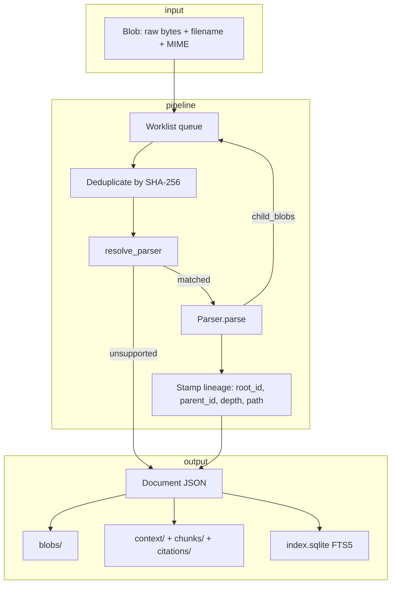

# User Manual

## 0. Setup, run, and test

### Prerequisites

- Python **3.12+**
- [uv](https://docs.astral.sh/uv/) package manager

Change into the project directory (quote the path if it contains spaces):

```bash
cd "/path/to/Email Parser"
```

### Install

Full local development (CLI + web + tests):

```bash
uv sync --extra web --extra dev
```

| Goal | Command |
|------|---------|
| CLI / library only | `uv sync` |
| + tests / lint | `uv sync --extra dev` |
| + web UI / API | `uv sync --extra web` |
| + scanned-PDF OCR | `uv sync --extra ocr` (adds `document-parser` + PaddleOCR) |
| Full local dev | `uv sync --extra web --extra dev` |
| Full dev + OCR | `uv sync --extra web --extra dev --extra ocr` |

### Generate fixtures (required)

Synthetic test emails are **not committed** to git. Generate them before running pytest or using **Run golden corpus** in the web UI:

```bash
uv run python tests/fixtures/generate.py
```

This creates 15 `.eml` and `.truth.json` pairs under `tests/fixtures/synthetic/`.

### Run tests

```bash
uv run pytest tests -q
```

OCR integration tests are marked `@pytest.mark.ocr` and skip automatically when `document-parser` or PaddleOCR is not installed. Run them explicitly after `uv sync --extra ocr`:

```bash
uv run pytest tests -m ocr -q
```

Verify fixtures first:

```bash
ls tests/fixtures/synthetic/*.eml | wc -l   # expect 15
```

### Run the web server

```bash
uv run uvicorn web.app:app --host 127.0.0.1 --port 8000
```

Open [http://127.0.0.1:8000](http://127.0.0.1:8000).

### Run the CLI

```bash
uv run email-parser --help
uv run email-parser parse tests/fixtures/synthetic/plain_no_attachment.eml
uv run email-parser metrics --corpus tests/fixtures/synthetic
```

### Environment variables

| Variable | Default | Purpose |
|----------|---------|---------|
| `EMAILPARSE_OUTPUT_DIR` | `output` | Artifact root directory |
| `EMAILPARSE_MAX_DEPTH` | `10` | Maximum nesting depth for attachments and forwards |
| `EMAILPARSE_MAX_FANOUT` | `200` | Maximum child documents per parent |
| `EMAILPARSE_TOKEN_BUDGET` | `6000` | Token budget for context markdown |
| `EMAILPARSE_PDF_ENGINE` | `pdf_pymupdf` | PDF parser plugin name |
| `EMAILPARSE_OCR_ENABLED` | `true` | Master OCR switch when `document-parser` is installed |
| `EMAILPARSE_OCR_DPI` | `200` | Rasterization DPI for OCR fallback |
| `EMAILPARSE_OCR_MIN_CHARS` | `20` | Sparse-text threshold (total chars across pages) to trigger OCR |
| `EMAILPARSE_DISPLAY_PATH_PREFIX` | `""` | Prefix for reveal-in-Finder paths (Docker sets `${PWD}/output`) |

### Troubleshooting

- **Missing Python packages:** run `uv sync --extra web --extra dev` from the project root; use `uv run` for all commands.
- **Stale `.venv` after moving the project:** `rm -rf .venv && uv sync --extra web --extra dev`.
- **`VIRTUAL_ENV` mismatch warning:** safe to ignore when using `uv run`; deactivate other virtual environments to silence it.
- **Fixture or golden-corpus errors:** run `uv run python tests/fixtures/generate.py`.

See [MANUAL_STEPS.md](MANUAL_STEPS.md) for a hands-on verification checklist.

## 1. What it does / does not do

This project parses RFC 822 email files (`.eml`) and nested attachments into a canonical JSON document tree. Each block can carry a citation anchor (page and bounding box for PDFs). The pipeline is fully deterministic: the same bytes always produce the same `doc_id` values and block structure.

**In scope**

- MIME email parsing (headers, bodies, attachments, forwards, inline images)
- PDF text extraction with page/bbox anchors via PyMuPDF
- Optional OCR for scanned PDF attachments and direct PDF uploads (PaddleOCR via `document-parser`)
- Plain-text attachments
- Content-addressed storage under `output/`
- SQLite + FTS5 search over chunked text
- Compact markdown context views for downstream RAG use
- CLI, HTTP API, and a local web UI

**Out of scope (this iteration)**

- No embeddings or vector search
- No OCR for non-PDF images (JPEG/PNG attachments are not OCR'd in v1)
- No PST, `.msg`, or full `.mbox` ingestion (header peek only for uploads)
- No LLM in the parse path; parsing never calls a model

## 2. Architecture

Parsing is driven by an iterative worklist in `email_parser/pipeline.py`. Parsers return child blobs; the pipeline enqueues them. It does not recurse inside parsers.



**Citation chain:** PDF blocks include `anchor.page` and `anchor.bbox`. The web API can render `/documents/{doc_id}/citations/{block_id}/thumbnail.png` from the stored blob. Email blocks use empty anchors for body text; quoted history is preserved as separate `quoted_history` blocks.

**OCR fallback:** Born-digital extraction via `pdf_tool` always runs first. OCR via `document_parser` runs only when all of the following are true:

1. `document-parser` is installed (`uv sync --extra ocr`) and `EMAILPARSE_OCR_ENABLED` is true
2. The PDF needs OCR (`needs_ocr`, empty blocks, or total extracted chars below `EMAILPARSE_OCR_MIN_CHARS`)
3. The PDF is a direct upload (root blob) or an email attachment / embedded / forwarded PDF child

Born-digital PDFs with a usable text layer are never OCR'd. When OCR is unavailable, the parser keeps the pdf_tool result and adds a provenance warning.

## 3. `output/` layout

All paths are relative to `EMAILPARSE_OUTPUT_DIR` (default: `output/`).

| Path | Description |
|------|-------------|
| `manifest.json` | Last run summary: `run_id`, `doc_count`, `root_count` |
| `index.sqlite` | SQLite index: documents, blocks, chunks, FTS5 virtual table |
| `blobs/<hh>/<sha256>.<ext>` | Raw bytes keyed by content hash; `<hh>` is first two hex digits |
| `documents/<hh>/<sha256>.json` | Canonical `Document` JSON; filename hex matches `doc_id` after `sha256:` |
| `context/<root_doc_id>.md` | Token-budgeted markdown for one root email family |
| `chunks/<root_doc_id>.jsonl` | Chunk records for FTS indexing (one JSON object per line) |
| `citations/<doc_id>/anchors.json` | Citation anchor metadata for a document |
| `runs/<run_id>/log.jsonl` | Append-only parse events (one JSON object per line) |
| `runs/<run_id>/metrics.json` | Run-level metrics snapshot |
| `uploads/<job_id>/` | Staged uploads from the web UI (not used by CLI parse) |

**Document JSON fields (top level)**

| Field | Meaning |
|-------|---------|
| `doc_id` | Content-addressed id: `sha256:<hex>` |
| `source_type` | `email`, `pdf`, `text`, `image`, or `unknown` |
| `mime_type` | Sniffed or declared MIME type |
| `root_id` | Top-level email id for this family |
| `parent_id` | Parent document id, or null for roots |
| `relation_to_parent` | `attachment`, `inline_image`, `embedded_file`, `forwarded_message`, etc. |
| `depth` | Nesting depth from root (0 = uploaded file) |
| `ordinal` | Sibling order among children |
| `path` | Human-readable lineage path, e.g. `attachment[0]/embedded_file[0]` |
| `metadata.common` | Cross-format facts: `title`, `created_at`, `byte_size`, `page_count`, `filename` |
| `metadata.native` | Format-specific facts (email headers, PDF producer, `chars_per_page`, etc.) |
| `blocks[]` | Ordered content units with `block_id`, `type`, `text` or `rows`, optional `anchor`, optional `child_doc_id` |
| `extractions[]` | Inferred fields (empty in parse output; reserved for downstream inference) |
| `provenance` | `parser`, `parser_version`, `status` (`ok`/`warning`/`failed`/`unsupported`), `warnings[]` |

## 4. Design choices and why

Each subsection names the alternative that was rejected.

### stdlib email over wrappers

**Chosen:** Python `email` package (`BytesParser`, `EmailMessage`, `email.policy.default`).

**Rejected:** Third-party MIME libraries (e.g. mail-parser, flanker). The stdlib is sufficient for RFC 822 structure, keeps dependencies small, and matches how CPython itself tests email edge cases.

### Choose one multipart/alternative branch

**Chosen:** When `multipart/alternative` is present, pick one body—HTML preferred over plain text—and ignore the other branch for block emission.

**Rejected:** Emitting both plain and HTML as duplicate blocks. That inflates token counts and breaks deterministic “one canonical body” expectations for RAG context.

### Keep quoted history as blocks

**Chosen:** Reply/forward text is split into `paragraph` blocks and `quoted_history` blocks (via quotequail when available, with `>`-prefix fallback).

**Rejected:** Stripping quoted text entirely. Legal and support threads often require quoted context; stripping loses recoverable content and hurts evaluation of quote detection.

### Content-addressed doc_ids

**Chosen:** `doc_id = sha256:<digest of raw bytes>`; pipeline deduplicates identical bytes within one parse.

**Rejected:** Random UUIDs or path-based ids. Content addressing gives idempotent storage, safe re-parse, and stable citation links across runs.

### Blocks with page/bbox anchors

**Chosen:** PDF paragraphs, headings, and tables store `anchor.page` and `anchor.bbox` (plus optional `quads`).

**Rejected:** Plain text-only PDF extraction without geometry. Downstream UIs and citation thumbnails need pinpoint locations, not page-level dumps.

### Iterative worklist vs recursion

**Chosen:** `collections.deque` worklist in `pipeline.process`; depth and fanout caps enforced centrally.

**Rejected:** Recursive `parse()` calls inside parsers. Recursion risks stack overflow on deep forwards, hides guard logic, and makes progress reporting harder.

### Parsers return child blobs

**Chosen:** `ParseResult(document, child_blobs=[])`; pipeline enqueues children.

**Rejected:** Parsers calling the pipeline or registry directly. That couples formats, breaks plug-in swapping, and prevents uniform deduplication and depth limits.

### PyMuPDF + AGPL note

**Chosen:** PyMuPDF 1.28.2 (`import pymupdf`) for PDF text, embedded files, and thumbnail rendering.

**Rejected:** pdfminer.six-only extraction (weaker layout/bbox support). PyMuPDF is AGPL-3.0 / commercial dual-licensed—fine for local and open-source use; revisit licensing before shipping in a closed proprietary product.

### Why not pymupdf4llm

**Chosen:** Custom block extraction with per-span bboxes from PyMuPDF text dicts.

**Rejected:** `pymupdf4llm.to_markdown()`. Its layout boxes are coarse page-level regions, unsuitable for block-level citation thumbnails and TEDS table evaluation.

### SQLite + FTS5

**Chosen:** Stdlib `sqlite3` with FTS5 over chunk text in `index.sqlite`.

**Rejected:** External search engines (Elasticsearch, Meilisearch). Local single-file index matches the offline, air-gapped goal and needs no extra services.

### Parsed facts vs extractions

**Chosen:** Header and layout facts live in `metadata`; `extractions[]` is reserved for inferred fields with confidence, method, and evidence.

**Rejected:** Mixing LLM guesses into `metadata`. Parsed facts must stay auditable; inference belongs in a separate layer.

### Three metric tiers

**Chosen:** Tier A run metrics (throughput/outcomes), Tier B health metrics (structure/invariants), Tier C accuracy metrics (labeled corpora only).

**Rejected:** A single aggregate score. Operators need run health without labels; researchers need accuracy only where ground truth exists.

## 5. CLI

Install dependencies (see [Section 0](#0-setup-run-and-test)), then invoke `email-parser`:

```bash
uv run email-parser --help
```

| Command | Purpose |
|---------|---------|
| `email-parser version` | Print package version |
| `email-parser metrics [--corpus PATH]` | Parse all `.eml` in a directory and print Tier A + B JSON metrics |
| `email-parser parse FILE [FILE ...] [-o OUTPUT]` | Parse files and persist artifacts under `output/` (or `-o`) |
| `email-parser compare RUN_A RUN_B` | Diff metrics and/or document trees (see below) |

**`parse` example**

```bash
uv run email-parser parse tests/fixtures/synthetic/plain_no_attachment.eml
uv run email-parser parse inbox/*.eml -o /tmp/emailparse-output
```

**`compare` example**

Accepts `runs/<id>/` directories, `metrics.json` files, or `documents/` trees:

```bash
uv run email-parser compare output/runs/abc123 output/runs/def456
uv run email-parser compare output/documents /tmp/baseline/documents
```

Prints added/removed/changed `doc_id` values when both sides expose a `documents/` tree; otherwise prints a JSON diff of metric keys.

## 6. API list

Base URL when running locally: `http://127.0.0.1:8000`

| Method | Path | Description |
|--------|------|-------------|
| GET | `/` | Web UI |
| GET | `/health` | `{ok, containerized, ocr_available, ocr_enabled}` |
| POST | `/peek` | Header-only preview for uploaded `.eml` files |
| POST | `/peek/pdf` | PDF metadata preview: `page_count`, `needs_ocr`, `filename` |
| POST | `/jobs/golden` | Parse synthetic fixtures; return run + health metrics |
| POST | `/jobs` | Upload files; start background parse job |
| GET | `/jobs/{job_id}` | Job status, metrics, root document ids |
| GET | `/jobs/{job_id}/events` | SSE progress stream |
| POST | `/jobs/{job_id}/cancel` | Request cooperative cancellation |
| GET | `/jobs/{job_id}/emails` | Root emails for a completed job (backward compat) |
| GET | `/jobs/{job_id}/documents` | Root emails and direct-upload PDFs for the results sidebar |
| GET | `/documents/{doc_id}` | Canonical document JSON |
| GET | `/documents/{doc_id}/detail` | Document, children, storage paths |
| GET | `/documents/{doc_id}/context` | Markdown context + token count |
| GET | `/documents/{doc_id}/citations/{block_id}/thumbnail.png` | PNG thumbnail for a cited PDF block |
| GET | `/search?q=` | FTS5 chunk search |
| GET | `/files/blob/{doc_id}` | Raw blob bytes |
| GET | `/files/json/{doc_id}` | Stored document JSON file |
| POST | `/files/reveal` | Reveal blob/json in Finder (macOS host only) |

## 7. UI three states

The web UI (`web/static/app.js`) has three panels:

1. **Upload** — drop zone accepts `.eml` and `.pdf`. Peek headers via `/peek` or PDF metadata via `/peek/pdf` (page count, scanned badge when `needs_ocr`). Hint text notes that scanned PDFs need `uv sync --extra ocr`.
2. **Processing** — progress bar, per-file/per-document status, Cancel. Subscribes to `/jobs/{id}/events` SSE.
3. **Results** — processed-items list (emails and PDFs) via `/jobs/{id}/documents`, detail pane with attachment tree, metrics view, context preview, search. Rows show PDF/OCR/scanned badges when applicable; a toast warns when scanned PDFs need OCR but it is unavailable.

State transitions: Upload → Processing on submit; Processing → Results when the job reaches `done`; Cancel returns to Upload with a toast.

## 8. Limitations / next iteration

- Scanned PDFs without OCR installed produce empty or sparse blocks; install with `uv sync --extra ocr` (PaddleOCR may not support every Python version — tests skip live OCR when unavailable).
- Unsupported formats (e.g. `.docx`, unknown binaries) become `unsupported` documents with warnings; the root email still parses when the unsupported file is an attachment.
- Jobs and SSE state are in-memory; restarting the server loses active job handles (artifacts on disk remain).
- `POST /files/reveal` works on macOS hosts only; disabled in Docker.
- No PST/`.msg`/full mbox parsing; embeddings and vector retrieval are future work.
- Tier C accuracy metrics require labeled sidecars (`.truth.json` on synthetic fixtures); they are not computed automatically on every run.

See also: [MANUAL_STEPS.md](MANUAL_STEPS.md), [ADDING_A_PARSER.md](ADDING_A_PARSER.md), [METRICS.md](METRICS.md).
